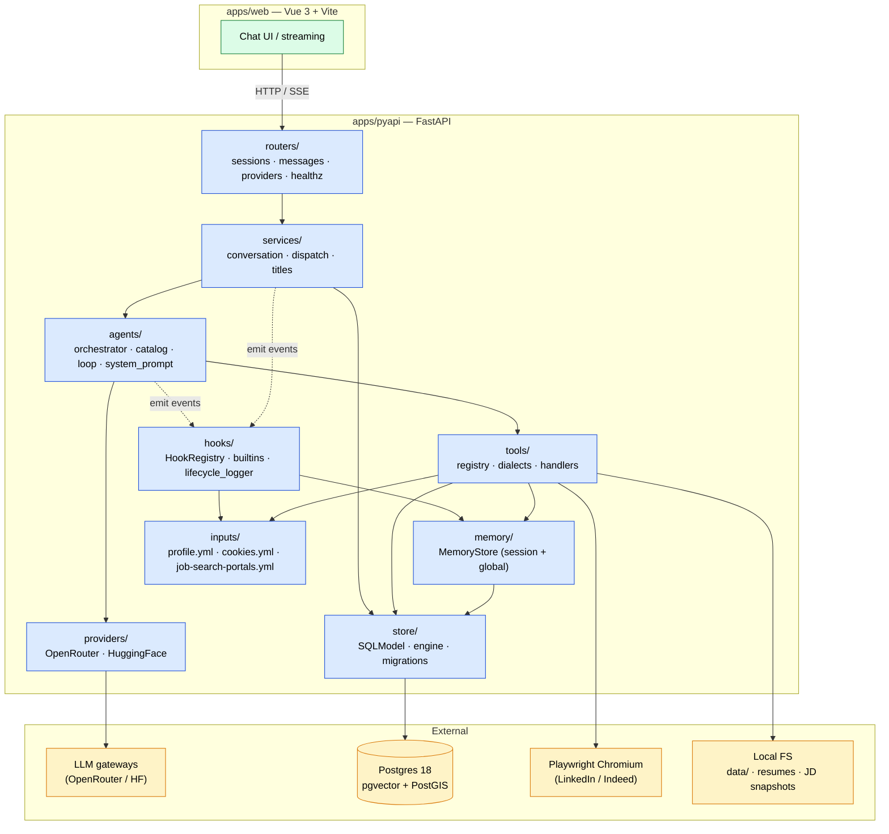

# 01 — System Architecture (High level layering)

Web client talks to FastAPI and FastAPI composes one immutable `AppServices` bundle. Then, it hands to every service call. The side-effect adapters (LLM API, Postgres, Playwright, FS) have to sit at the edge.



## Layer responsibilities

| Layer | Purpose | Knows about |
|---|---|---|
| **Routers** | HTTP surface — validation, pagination, status codes | Services + DTOs |
| **Services** | Use-case orchestration (one request = one service call) | Agents, Store, AppServices |
| **Agents** | LLM tool-calling loop + sub-agent delegation | Providers, Tools, Hooks |
| **Tools** | Side-effect actions (search jobs, parse JD, render PDF, memory CRUD) | Browser, FS, Store, Inputs |
| **Hooks** | Cross-cutting concerns: memory injection, profile injection, rate-limit, logging | Memory, Inputs |
| **Memory** | Scoped key-value store (per-session + global), injected into system prompt | Store |
| **Store** | Postgres CRUD via SQLModel | Postgres |
| **Providers** | Stateless LLM clients implementing `ChatProvider` protocol | LLM gateways |
| **Inputs** | Static YAML config loaders (profile, cookies, job-search prefs) | FS |

## AppServices (the dependency bundle)
```
AppServices(
    store, chat_provider, chat_config, context, tools,
    catalog,           # dict[str, SubAgent]
    hooks,             # HookRegistry
    lifecycle,         # LifecycleLogger
)
```
