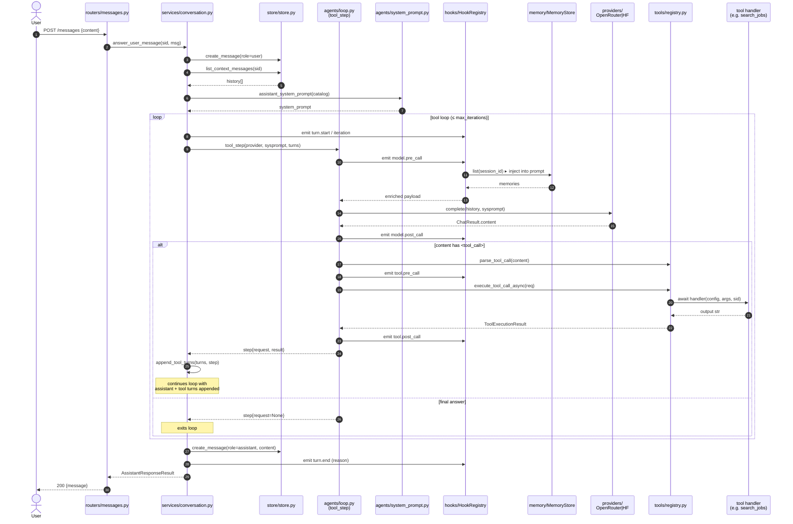

# 02 — Request Flow

End-to-end sequence of `POST /api/sessions/{sid}/messages` — from HTTP in to assistant reply out. Covers the main (non-delegating) loop. Delegation path is in `03-agent-orchestration.md`.

## Key invariants

- **One LLM round-trip per iteration.** `tool_step` makes exactly one `provider.complete()` call. The loop iterates until the model emits no tool call OR `max_iterations` is hit.
- **Tool results are system turns.** `append_tool_turns` adds an `assistant` turn (the raw tool call) followed by a `system` turn (`Tool result (name, ok|error): ...`). The next iteration sees both.
- **Hooks can short-circuit.** A handler raising `HookHalt(payload)` replaces the natural result (used for caching, rate-limiting, mocking).
- **Async-aware tool dispatch.** `execute_tool_call_async` (`tools/registry.py`) inspects handler return; awaits coroutines, returns sync results as-is. Lets Playwright-based handlers run on the FastAPI event loop without `asyncio.run()`.
- **Failures are visible, not fatal.** A tool exception becomes `ToolExecutionResult(ok=False, output=str(err))` — the model sees the error and decides next step.

## Persisted records are written

| Table | Written by | When |
|---|---|---|
| `sessions` | `Store.create_session` | router POST `/api/sessions` |
| `messages` (user) | `Store.create_message` | `answer_user_message` start |
| `messages` (assistant) | `Store.create_message` | `answer_user_message` end |
| `tool_calls` | `tool.post_call` hook handler | every successful/failed tool exec |
| `memories` | `remember` / `forget` tool handlers | on demand by the model |
