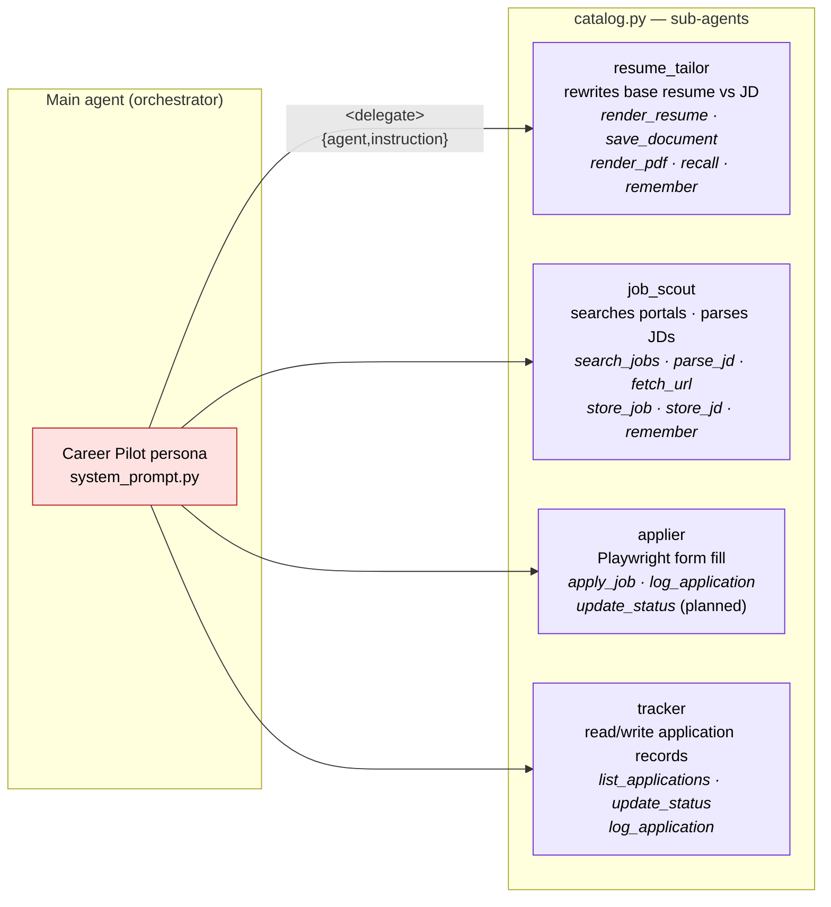
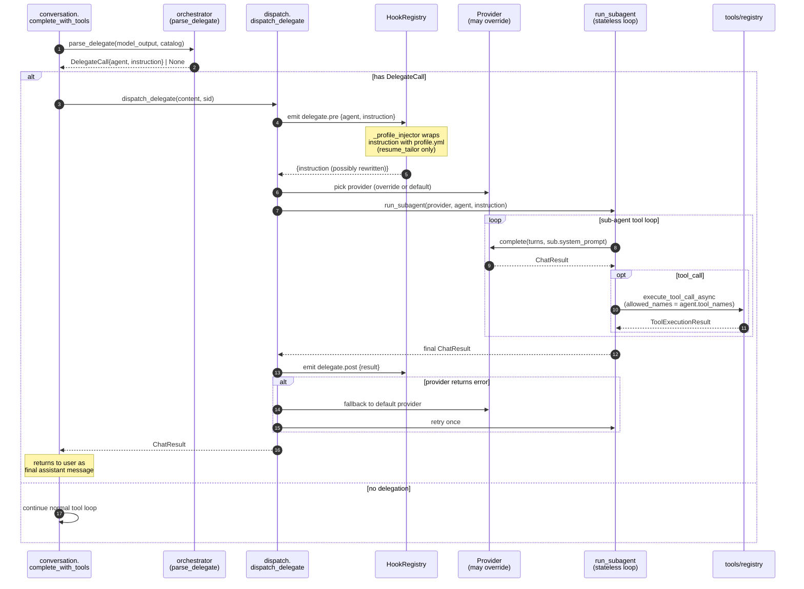

# 03 — Agent Orchestration

The main agent (Career Pilot persona) can delegate a turn to one focused sub-agent. Each sub-agent has a tool allowlist, its own system prompt, and optionally its own model. Delegations are stateless one-shots; a sub-agent's result is returned to the user directly, so at most one delegation happens per user turn.

## Catalog



`SubAgent` shape (`agents/base.py:6`):

```python
SubAgent(name, description, system_prompt, tool_names, provider_override?, model_override?)
```

## Delegation sequence



## hmmm some oversights

- **Cost control.** Sub-agents can pin cheaper models (`model_override`) — the orchestrator routes structured work to a smaller LLM without losing the main persona.
- **Tool least-privilege.** A sub-agent can only call tools in its `tool_names` allowlist. The registry enforces this at `execute_tool_call_async` (`tools/registry.py`).
- **One delegation per turn.** The main loop returns the sub-agent's result to the user immediately, and sub-agents can't parse `<delegate>` tags themselves — so recursion is impossible by construction.
- **Stateless sub-agents.** Sub-agents receive only the instruction string — no prior history. Forces the orchestrator to summarise context, keeps sub-agent prompts deterministic and cacheable.
- **Hot-swap via hooks.** `delegate.pre` lets you mutate the instruction before the sub-agent sees it (today: inject `profile.yml` for `resume_tailor`). Same hook can mock/cache in tests.
