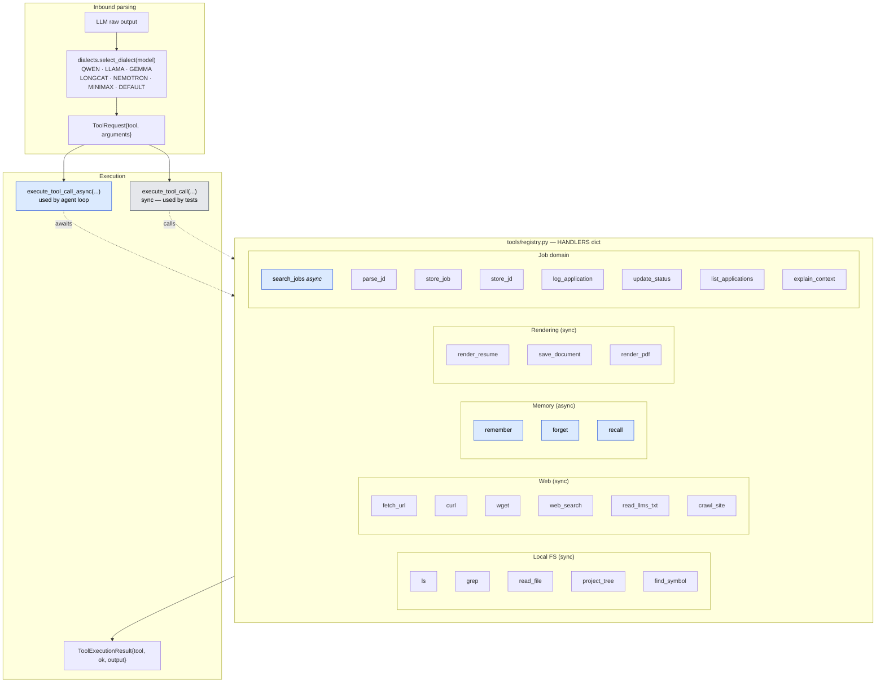
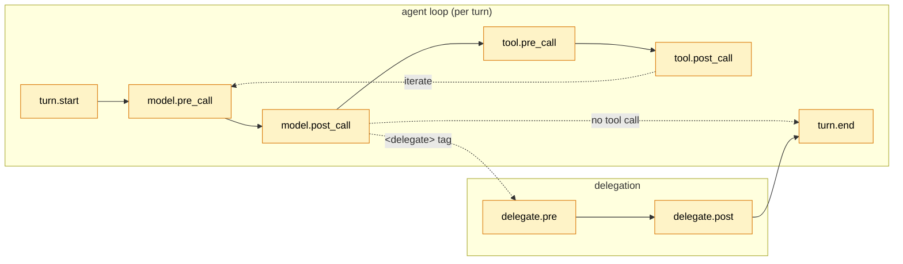

# 04 — Tools & Hooks

**Tools** are the model's hands. **Hooks** are the event bus the runtime fires at fixed lifecycle points; handlers can observe, mutate, short-circuit, or persist.

## Tool registry



Async awared dispatch: Required for Playwright-based handlers (`search_jobs`) and async memory I/O. They run on the FastAPI event loop without spawning new ones.

## Tool capabilities ↔ system prompt

`agents/system_prompt.py:format_capabilities` injects a per-capability list into the prompt, gated by:
- `tools.enabled` — master switch
- `tools.internet_enabled` — hides web/job-domain tools when off
- per-sub-agent `tool_names` allowlist

The model only sees tools it can actually call.

## Hook lifecycle



## Built-in handlers (registered at startup)

| Handler | Event | Effect |
|---|---|---|
| `_memory_injector` | `model.pre_call` | Loads session plus global memories and appends to `system_prompt` |
| `_profile_injector` | `delegate.pre` (resume_tailor only) | Wraps the instruction with `profile.yml` YAML |
| `LifecycleLogger` | all 6 events + turn.start/end | Structured logs with session_id, sequence #, agent, model, call counts |
| `llm_call_throttle` | `model.pre_call` | Rate-limit guard |

## Handler contract

```python
async def handler(event: str, payload: dict) -> dict
```

- Return value is shallow merged into payload for next handler in chain.
- Raise `HookHalt(payload)` to short-circuit (skip remaining handlers + the natural operation). Used by `pre_tool` to inject cached results, by `pre_call` to inject mocked LLM responses in tests.
- Handlers are async; the registry `await`s each one in registration order.


- **Composability.** Adding caching, observability, or a rate limit doesn't touch the loop.
- **Test surface.** Hooks let tests inject deterministic results at the same seam production runs.
- **Plugin slot.** Future evals, OpenTelemetry exports, or token accounting all hang off these events without rewriting `loop.py`.
