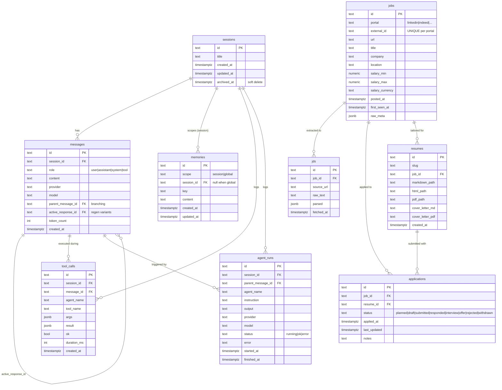

# 05 — Data Model (Postgres)

Single Postgres 18 instance with pgvector extensions available (unused at MVP — kept for future similar-job matching and geo queries). Schema is split into three concerns: **chat substrate**, **observability**, **job-hunt domain**.



## Store CRUD surface (`store/store.py`)

```
Sessions:  list · create · get · update_title · delete (archive)
Messages:  list · list_context · list_page · create · set_active_response
Memories:  list(sid, include_global) · get · upsert · delete   [MemoryStore]
Jobs/JDs/Resumes/Applications: written by tool handlers, read by tracker sub-agent
```
